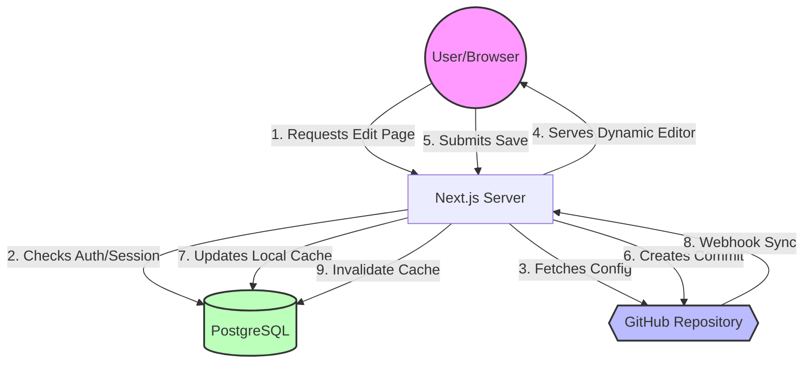

# Pages CMS: Complete Project Analysis & Visual Architecture

This document serves as a comprehensive guide to understanding the **Pages CMS** project. Use this for onboarding, deep-dives, or architectural review.

---

## 🏗️ 1. High-Level Architecture
Pages CMS is a **Git-based CMS**. Its primary philosophy is that **GitHub is the source of truth** for content, while a local database acts as a high-performance cache and session manager.

### The "Bridge" Flow
1.  **Identity**: Users log in via GitHub OAuth (using **Lucia Auth**).
2.  **Discovery**: The CMS reads `pages-cms.json` from the repository to understand the structure (Collections, Fields).
3.  **Optimization**: Metadata and file structures are mirrored into a local **Postgres** database via **Drizzle ORM** for instant browsing.
4.  **Editing**: A dynamic UI is generated using the **Field System**.
5.  **Execution**: Saving or deleting content triggers a direct Commit/Push to GitHub via the **Octokit API**.

---

## 🗺️ 2. Structural Flow Diagram (Operational)

The following diagram represents the core lifecycle of a content edit:



---

## 📂 3. Global Project Structure

```text
pages-cms/
├── app/                  # NEXT.JS LAYER (The Routes)
│   ├── (auth)/           # Login & Permissions logic
│   ├── (main)/           # Dashboard UI (Dynamic path: [owner]/[repo])
│   └── api/              # Public & Private endpoints (Webhooks)
├── components/           # UI LAYER (The Elements)
│   ├── ui/               # Atomic components (Buttons, Inputs)
│   ├── file/             # Logic for managing files (Rename/Move)
│   └── collection/       # Table views and file list logic
├── db/                   # STORAGE LAYER (The Cache)
│   ├── schema.ts         # User Tables & Github Mirroring logic
│   └── migrations/       # Version control for DB schema
├── fields/               # EDITOR ENGINE (The Modular Inputs)
│   ├── core/             # Field-specific code (Text, Images, Date)
│   └── registry.ts       # Global map linking config types to React components
├── lib/                  # BUSINESS LOGIC (The "How-to")
│   ├── githubApp.ts      # Low-level API calls to GitHub
│   ├── githubCache.ts    # Logic that keeps the DB in sync with Git
│   ├── config.ts         # Logic for parsing the user's YAML/JSON config
│   └── actions/          # Operations (Save, Delete, Invite)
└── types/                # INTELLISENSE LAYER (The Contract)
```

---

## 📖 4. Study-Based Learning Plan

### Phase 1: The Foundation (Data & Schema)
*   **Target**: `db/schema.ts`
*   **Objective**: Understand how the `cache_file` table allows the app to browse thousands of files instantly without hitting GitHub API limits.

### Phase 2: Configuration (The Intelligence)
*   **Target**: `lib/config.ts`
*   **Objective**: Learn how the CMS parses `pages-cms.json`. This is how the app knows whether a folder is a "Blog" collection or a "Media" folder.

### Phase 3: The Field System (UI Modularity)
*   **Target**: `fields/registry.ts`
*   **Objective**: Discover how the CMS mounts different editors (Markdown vs Simple Text) dynamically based on the configuration.

### Phase 4: Sync & GitHub Integration
*   **Target**: `lib/githubCache.ts` and `lib/githubApp.ts`
*   **Objective**: Study the handshake. How a "Save" button click travels from a Server Action and eventually becomes a Git Commit.

---

## 🛠️ Key Technical Stack
*   **Framework**: Next.js 14+ (App Router)
*   **Styling**: Tailwind CSS / shadcn/ui
*   **Database/ORM**: PostgreSQL / Drizzle ORM
*   **Authentication**: Lucia Auth
*   **API**: GitHub REST API (Octokit)

---

*Generated for onboarding - Version 1.1*
