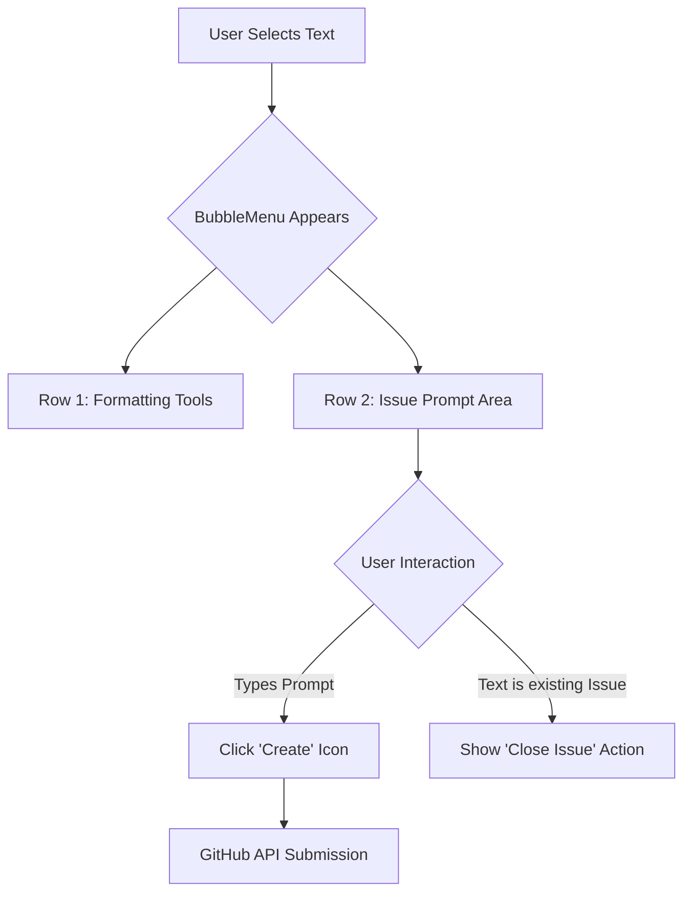

# Implementation Plan: Automatic Inline Issue Prompt

This plan outlines the implementation of an **automatic** prompt area that appears whenever text is selected, removing the need for a "Bug" button and disruptive dialogs.

## 1. Architectural Overview: Automatic Flow

The system will eliminate the manual "Bug" button. The `BubbleMenu` will dynamically expand to include an **Issue Prompt Area** whenever a non-empty text selection is detected.

### Flow Diagram

## 2. UI/UX Specifications: The "Dual-Tier" Menu

- **The Layout**: A single floating menu with two distinct sections.
- **Top Tier**: Standard icons (Bold, Link, etc.) for quick formatting.
- **Bottom Tier (The Automatic Prompt)**: 
    - A compact, auto-expanding `Textarea`.
    - Placeholder: *"Describe issue or prompt..."*
    - A small **Action Button** (e.g., a "Plus" or "Send" icon) at the end of the textarea.
- **Visual Style**:
    - Dark-themed, glassmorphic (blur) backdrop.
    - Subtle separation line between the toolbar and prompt area.
    - Focus-rings that glow when typing in the prompt.

## 3. Implementation Steps

### Phase 1: Modify `BubbleMenu`
- Adjust the `BubbleMenu` in `edit-component.tsx` to have a vertical layout (flex-col).
- Remove the `<Button><Bug /></Button>` component from the toolbar.

### Phase 2: Create Inline Prompt Component
- Implement a `Textarea` directly within the `BubbleMenu` div.
- Add a new button for "Create Issue" and "Close Issue" that toggles based on the selection's attributes (`data-issue-number`).

### Phase 3: Logic Updates
- Simplify `handleIssueAction` to use the current value of the inline textarea.
- Automatically generate a title (e.g., first 50 characters of prompt) if the user doesn't provide one.
- Ensure clicking the textarea doesn't dismiss the `BubbleMenu` (handle focus events).

## 4. Why this is better
- **Zero Clicks**: The moment you select text, you are ready to report.
- **Contextual**: You can format and report an issue simultaneously.
- **Reduced GUI**: Fewer buttons = a cleaner, more modern editor.
